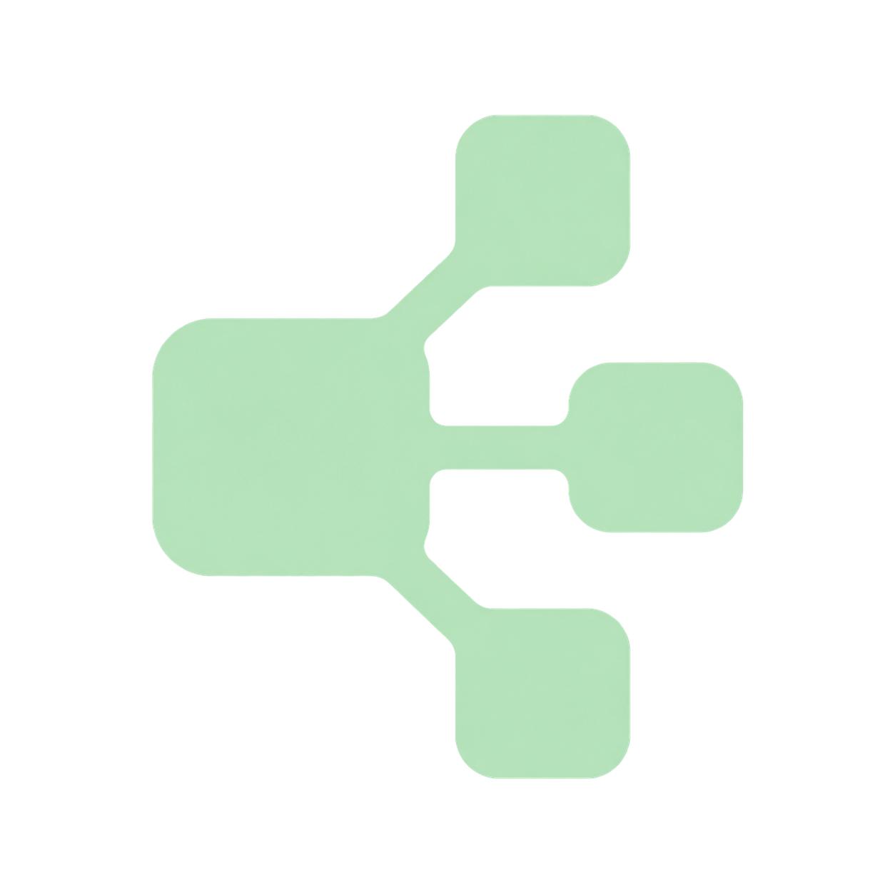

<p align="center"></p>
<h1 align="center">合流 · Model Team</h1>
<p align="center">让合适的模型，并行做好每一件事。</p>

合流是本地运行的多模型协作配置台，可接入 Codex。总指挥自主判断自己完成或按需委派，不把任务固定拆成几个步骤；两个以上互不依赖的子任务可以一次并行分给不同模型。每次委派前简述「任务 → 模型」，子模型提供建议，主助手负责整合、改文件与验证。

## 功能

- **长期配置**：在网页保存候选模型、密钥、适用场景和偏好，后续任务按需读取。
- **三种模式**：均衡（默认）、极致、轻量。所有模式保持验收标准。
- **多种通道**：OpenAI 兼容接口、Anthropic 原生接口、Codex 已有登录、独立 Codex 服务商。
- **并行分工**：单项委派或一次并行委派 2 至 6 个独立任务，受用户设置的并行上限约束。
- **上下文精简**：三个 MCP 工具，只传任务所需片段，不自动转发完整会话。
- **团队令牌**：可接入团队网关，成员使用可撤销、可限额的独立令牌，看不到上游原始 key。
- **可扩展**：通过网页添加兼容模型；通过协议注册表增加新接口，网页自动列出。
- **记录与限制**：调用结果、用量、可选费用估算、并行与上下文限制、重复请求标识。

## 快速开始

需要 Node.js 22 或更高版本。Codex 接入和 Codex 通道另外需要已安装、已登录的 Codex CLI（开发时使用 0.154.0，旧版可能缺少必要参数）。

```sh
git clone https://github.com/huangbai-AI/model-team.git
cd model-team
npm ci
npm start
```

打开 http://127.0.0.1:4317 ：

1. 添加自己的模型、地址和密钥，测试连接。
2. 选择均衡、极致或轻量，并填写适用场景。
3. 点击「连接 Codex」，重启 Codex，在新会话加载工具。

此后在 Codex 中正常提开发需求即可。关闭网页不影响配置保存；Codex 会单独启动协作工具进程。修改配置后，下次读取模型列表时生效。

macOS 可双击 `启动合流.command`；旧的 `启动分工台.command` 仍可使用。也可以运行 `npm run open` 启动并打开网页。

**仓库不附带任何密钥、个人模型配置或调用记录。首次启动候选列表为空。**

## 选择原则

| 模式 | 偏好                                                 |
| ---- | ---------------------------------------------------- |
| 均衡 | 兼顾效果、实际费用、等待与返工，选择足够可靠的模型   |
| 极致 | 优先最佳效果和可靠性，接受更多时间与成本，必要时复核 |
| 轻量 | 减少费用、等待和上下文；复杂或高风险任务及时升级     |

这些是给总指挥的判断参考，不是按关键词或固定步骤分配模型。模型说明不是能力排名，需按实际成功率调整；连接测试不等于质量测试。

## 扩展与开发

见 [扩展指南](docs/EXTENDING.md) 和 [无密钥示例](examples/models.example.json)。示例供参考，不会自动导入配置。

```sh
npm test
npm run check:secrets
```

测试使用本地模拟服务，不消耗模型额度。若系统未安装 Codex CLI，跳过真实 CLI 配置安装检查，其余测试照常执行。

```text
core.mjs               配置、密钥存储、委派与记录
adapters/protocols.mjs  可扩展协议注册表
adapters/http.mjs       共享请求、超时与用量处理
adapters/codex.mjs      独立 Codex 子模型通道
mcp.mjs                候选读取、单项委派、并行委派
server.mjs             本地网页服务与 Codex 接入
public/                网页和标志
```

可选环境变量：`PORT`（默认 4317）、`MODEL_TEAM_DATA`（默认项目 `.data`，须使用绝对路径）、`MODEL_TEAM_CODEX_BIN`（Codex 可执行文件）、`MODEL_TEAM_CODEX_HOME`（接入目标 Codex 目录）。使用自定义数据目录时，接入会让 MCP 使用同一目录。

## 边界与安全

- 只监听本机回环地址。不是公网服务，不要直接暴露端口。
- 密钥采用 AES-256-GCM 加密；解密材料也在本机，所以不能抵御已控制该电脑的攻击者。不要分享 `.data`，其中还包含模型输出与任务记录。
- 自动分工依赖主助手遵循长期规则，不保证每个任务都委派。结果必须由主助手验证。
- API 模型没有文件工具；Codex 子模型在只读模式运行并被要求不使用工具，这不是操作系统级完全隔离。
- 并行限制针对单个工具进程；重复请求标识不能充当跨进程全局事务锁。
- Codex 输出长度由提示约束，不是硬性预算；价格估算需自行填写，不能替代服务商账单。自行确认服务商套餐适用范围。
- 接入会备份已有配置，添加工具和一小段全局规则，不改变主模型。

## 团队共享额度

不要把上游原始 key 发给团队，也不要把“加密后的 key”发到成员电脑。部署 [团队密钥网关](team-gateway/README.md)，让网关持有真实 key，再给每位成员签发独立令牌。成员在合流中选择“团队网关令牌”即可接入；管理员可以单独撤销、限额和审计。

移除：执行 `codex mcp remove model-team`，删除 Codex 配置目录的 `skills/model-team`，从 `AGENTS.md` 中移除 `model-team:start` / `model-team:end` 标记区间，保留其他内容。

## 许可

[MIT](LICENSE)。标志由 AI 辅助生成。本项目为独立项目，不代表 OpenAI 或其他模型服务商。
